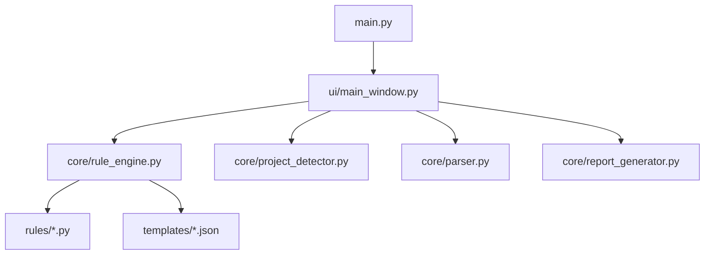

# CodeReview-C 开源C语言静态代码分析工具

> **项目定位**: 专注C语言代码评审，智能化+教育化+本土化  
> **目标用户**: 嵌入式开发者、C语言学习者、代码review负责人  
> **核心理念**: 让《C陷阱与缺陷》变成自动化工具  

## 📋 项目需求说明

### 核心功能需求

#### 1. 自动项目检测
- [x] **C语言版本自动检测**: 基于项目文件和代码特性自动识别C90/C99/C11/GNU标准
- [x] **项目类型识别**: 自动识别ESP32、STM32_HAL、Arduino、Keil_MDK、Linux_GNU等项目类型
- [x] **智能规则推荐**: 根据项目类型推荐合适的检查规则模板

#### 2. 代码静态分析
- [x] **语法解析**: 基于tree-sitter的准确C语法解析
- [x] **规则引擎**: 可插拔的规则检查系统
- [ ] **数据流分析**: 变量初始化、使用路径分析（部分实现）
- [ ] **控制流分析**: 死代码、无限循环检测
- [ ] **类型检查**: 隐式类型转换、溢出检查

#### 3. 规则体系
- [x] **基础规则**: 数组越界、空指针、赋值误写等核心规则
- [ ] **《C陷阱与缺陷》规则集**: 覆盖书中所有经典案例
- [ ] **MISRA-C规则**: 工业级代码标准规则
- [ ] **嵌入式专用规则**: ESP32/STM32特定问题检查
- [ ] **自定义规则**: 用户可添加自定义检查规则

#### 4. 用户界面
- [x] **现代化GUI**: 基于CustomTkinter的友好界面
- [x] **项目扫描**: 拖拽文件夹即可开始分析
- [ ] **规则配置界面**: 图形化规则启用/禁用配置
- [ ] **结果详情查看**: 问题详情、修复建议、代码片段展示
- [ ] **报告导出**: HTML/PDF/TXT多格式报告生成

#### 5. 教育功能
- [x] **规则说明**: 每个规则都有中英文说明
- [ ] **经典参考**: 关联《C陷阱与缺陷》等经典书籍
- [ ] **示例代码**: 错误代码和正确代码对比
- [ ] **修复建议**: 具体的代码修改建议

### 非功能需求

- **性能**: 单个文件解析时间 < 100ms，项目扫描时间合理
- **易用性**: 零配置快速开始，5分钟上手
- **可扩展性**: 规则引擎支持插件化扩展
- **稳定性**: 异常处理完善，不会因单个文件错误影响整体
- **国际化**: 支持中英文界面和规则说明

## 🏗️ 技术架构设计

### 技术栈选择

```yaml
编程语言: Python 3.7+
解析引擎: tree-sitter + tree-sitter-c
GUI框架: CustomTkinter (现代化外观)
报告生成: Jinja2 + WeasyPrint
项目检测: 文件模式 + 内容分析
包管理: pip + requirements.txt
```

### 核心架构

```
┌─────────────────┐    ┌─────────────────┐    ┌─────────────────┐
│   用户界面层    │───▶│   业务逻辑层    │───▶│   数据解析层    │
│                 │    │                 │    │                 │
│ - 主窗口        │    │ - 规则引擎      │    │ - 代码解析器    │
│ - 规则配置      │    │ - 项目检测器    │    │ - AST分析       │
│ - 结果查看      │    │ - 报告生成器    │    │ - 文件处理      │
└─────────────────┘    └─────────────────┘    └─────────────────┘
```

### 模块依赖关系



## 📁 项目目录结构

```
CodeReview-C/
├── README.md                     # 项目说明文档
├── DEVELOPMENT.md                 # 本开发文档
├── requirements.txt               # Python依赖包
├── main.py                       # 程序入口
├── setup.py                      # 安装脚本
├── LICENSE                       # 开源协议
│
├── core/                         # 核心功能模块
│   ├── __init__.py
│   ├── parser.py                 # ✅ 代码解析器
│   ├── rule_engine.py            # ✅ 规则引擎核心
│   ├── project_detector.py       # ✅ 项目类型检测
│   └── report_generator.py       # ❌ 报告生成器
│
├── rules/                        # 规则实现模块
│   ├── __init__.py
│   ├── base_rule.py              # ✅ 规则基类
│   ├── memory_rules.py           # 🔄 内存安全规则 (部分完成)
│   ├── logic_rules.py            # 🔄 逻辑错误规则 (部分完成)
│   ├── style_rules.py            # ❌ 代码风格规则
│   ├── misra_rules.py            # ❌ MISRA-C规则
│   └── embedded_rules.py         # ❌ 嵌入式专用规则
│
├── ui/                           # 用户界面模块
│   ├── __init__.py
│   ├── main_window.py            # ✅ 主窗口 (基本完成)
│   ├── rule_config.py            # ❌ 规则配置界面
│   ├── result_viewer.py          # ❌ 结果查看器
│   └── about_dialog.py           # ❌ 关于对话框
│
├── templates/                    # 规则模板配置
│   ├── beginner.json             # ✅ 新手友好版
│   ├── c_traps.json              # ❌ C陷阱与缺陷版
│   ├── embedded.json             # ❌ 嵌入式专用版
│   ├── misra_c.json              # ❌ MISRA-C精选版
│   └── enterprise.json           # ❌ 企业级严格版
│
├── assets/                       # 资源文件
│   ├── icons/                    # 图标文件
│   │   ├── app.ico
│   │   ├── error.png
│   │   ├── warning.png
│   │   └── info.png
│   └── styles/                   # 样式文件
│       └── dark_theme.json
│
├── docs/                         # 文档目录
│   ├── user_guide.md             # 用户使用指南
│   ├── rule_reference.md         # 规则参考手册
│   └── developer_guide.md        # 开发者指南
│
├── tests/                        # 测试代码
│   ├── __init__.py
│   ├── test_parser.py            # 解析器测试
│   ├── test_rules.py             # 规则测试
│   ├── test_detector.py          # 检测器测试
│   └── sample_projects/          # 测试用例项目
│       ├── esp32_sample/
│       ├── stm32_sample/
│       └── generic_c_sample/
│
├── scripts/                      # 工具脚本
│   ├── build.py                  # 构建脚本
│   ├── package.py                # 打包脚本
│   └── install_deps.py           # 依赖安装脚本
│
└── output/                       # 输出目录 (运行时生成)
    ├── reports/                  # 生成的报告
    ├── configs/                  # 用户配置
    └── logs/                     # 日志文件
```

## ✅ 已完成功能

### 1. 核心解析引擎 (core/parser.py)
- [x] 基于tree-sitter的C语言AST解析
- [x] 自动编码检测和文件读取
- [x] 递归目录扫描和C文件识别
- [x] 函数定义、变量声明等基础AST节点查找
- [x] 错误处理和异常恢复

**代码特点:**
- 支持多种编码格式 (UTF-8, GBK, GB2312等)
- 提供便捷的AST节点查询接口
- 文件统计和解析进度跟踪

### 2. 规则引擎核心 (core/rule_engine.py)
- [x] 可扩展的规则基类 `BaseRule`
- [x] 规则模板加载和应用机制
- [x] 问题记录数据结构 `Issue`
- [x] 严重程度分级 (严重/警告/建议)
- [x] 规则启用/禁用控制
- [x] 批量文件检查流程

**已实现规则:**
- [x] `ArrayBoundsRule` - 数组越界检查
- [x] `UninitializedVariableRule` - 未初始化变量检查 (简化版)
- [x] `AssignmentInConditionRule` - 条件中赋值检查

### 3. 项目类型检测 (core/project_detector.py)
- [x] 自动识别项目类型 (ESP32/STM32/Arduino/Keil/Linux/Generic)
- [x] C语言标准检测 (C90/C99/C11/GNU)
- [x] 基于文件模式和代码内容的智能分析
- [x] 置信度评分和特征说明
- [x] 规则推荐机制

**检测能力:**
- 特征文件识别 (CMakeLists.txt, *.ioc, sdkconfig等)
- 头文件包含分析 (esp_*.h, stm32*hal*.h等)
- 宏定义和语法特性检测

### 4. 主界面框架 (ui/main_window.py)
- [x] 基于CustomTkinter的现代化界面
- [x] 项目选择和扫描功能
- [x] 规则模板选择
- [x] 结果统计和树形显示
- [x] 进度条和状态提示
- [x] 问题详情查看窗口

**界面特点:**
- 清晰的功能分区布局
- 实时的扫描和检查进度反馈
- 友好的错误处理和用户提示

### 5. 配置系统
- [x] 新手友好版规则模板 (templates/beginner.json)
- [x] 依赖包管理 (requirements.txt)
- [x] 程序入口和依赖检查 (main.py)

## 🚧 待完成功能

### 优先级P0 (核心功能)

#### 1. 规则配置界面 (ui/rule_config.py)
```python
# 需要实现的功能
- 规则分类树形展示
- 规则启用/禁用切换
- 规则详情查看 (说明、示例、参考)
- 自定义规则添加向导
- 配置导入/导出功能
```

#### 2. 报告生成器 (core/report_generator.py)  
```python
# 需要实现的功能
- HTML报告生成 (带CSS样式)
- PDF报告导出
- 文本报告生成
- 报告模板系统
- 统计图表生成
```

#### 3. 更多核心规则实现
```python
# memory_rules.py - 内存安全规则
- NullPointerRule - 空指针检查
- MemoryLeakRule - 内存泄漏检查
- BufferOverflowRule - 缓冲区溢出
- UseAfterFreeRule - 释放后使用

# logic_rules.py - 逻辑错误规则  
- SwitchFallthroughRule - switch缺少break
- InfiniteLoopRule - 无限循环检测
- UnusedVariableRule - 未使用变量
- FunctionReturnRule - 函数返回值检查
```

### 优先级P1 (增强功能)

#### 4. 完整规则模板
```json
// c_traps.json - 《C陷阱与缺陷》版
// embedded.json - 嵌入式专用版  
// misra_c.json - MISRA-C精选版
// enterprise.json - 企业级严格版
```

#### 5. 嵌入式专用规则 (rules/embedded_rules.py)
```python
# ESP32/STM32特定规则
- ISRFunctionRule - 中断服务程序检查
- VolatileUsageRule - volatile使用检查
- HardwareRegisterRule - 硬件寄存器访问
- TaskStackRule - FreeRTOS任务栈检查
```

### 优先级P2 (完善功能)

#### 6. 高级分析功能
```python
# 数据流分析增强
- 变量初始化路径分析
- 指针别名分析  
- 函数调用图分析

# 控制流分析
- 死代码检测
- 不可达代码分析
- 循环复杂度计算
```

#### 7. 用户体验优化
```python
# 界面增强
- 暗色主题支持
- 快捷键支持
- 拖拽操作优化
- 多语言支持

# 性能优化
- 增量分析支持
- 多线程解析
- 内存使用优化
```

### 优先级P3 (扩展功能)

#### 8. 集成和扩展
```python
# IDE集成
- VS Code插件
- Source Insight插件
- Vim/Emacs插件

# CI/CD集成  
- GitHub Actions支持
- GitLab CI支持
- Jenkins插件

# 命令行版本
- CLI参数解析
- 批处理模式
- 配置文件支持
```

## 🎯 开发里程碑

### Milestone 1: 核心功能完善 (预计2-3周)
- [ ] 完成规则配置界面
- [ ] 实现报告生成器
- [ ] 添加15-20个核心规则
- [ ] 完善错误处理和用户体验

### Milestone 2: 规则库建设 (预计2-3周)  
- [ ] 《C陷阱与缺陷》完整规则集
- [ ] MISRA-C核心规则实现
- [ ] 嵌入式专用规则开发
- [ ] 所有规则模板完成

### Milestone 3: 功能增强 (预计1-2周)
- [ ] 高级静态分析功能
- [ ] 性能优化和稳定性提升  
- [ ] 完整的测试用例
- [ ] 用户文档和帮助系统

### Milestone 4: 发布准备 (预计1周)
- [ ] 代码重构和优化
- [ ] 完整的文档体系
- [ ] 安装包制作
- [ ] 宣传材料准备

## 🧪 测试策略

### 单元测试
```python
# 需要覆盖的测试模块
tests/test_parser.py      # 解析器功能测试
tests/test_rules.py       # 规则逻辑测试  
tests/test_detector.py    # 项目检测测试
tests/test_engine.py      # 规则引擎测试
```

### 集成测试  
```python
# 端到端测试用例
tests/sample_projects/    # 各种类型的示例项目
- esp32_sample/          # ESP32项目测试用例
- stm32_sample/          # STM32项目测试用例  
- arduino_sample/        # Arduino项目测试用例
- c_traps_sample/        # C陷阱代码测试用例
```

### 性能测试
```python
# 性能基准
- 单文件解析时间 < 100ms
- 1000个文件项目扫描 < 30s
- 内存使用 < 500MB
- GUI响应时间 < 200ms
```

## 📖 技术决策记录

### 为什么选择tree-sitter？
1. **解析准确性**: 相比正则表达式，AST解析更准确
2. **性能优秀**: C实现，解析速度快
3. **增量解析**: 支持代码增量更新
4. **语言支持**: C语言语法支持完善

### 为什么选择CustomTkinter？
1. **现代外观**: 相比原生tkinter更美观
2. **易于使用**: API简单，学习成本低
3. **跨平台**: Windows/Mac/Linux一致体验
4. **轻量级**: 不需要额外的重型框架

### 为什么采用插件化规则？
1. **可扩展性**: 方便添加新规则
2. **可维护性**: 规则独立，便于调试
3. **可配置性**: 用户可选择需要的规则
4. **教育价值**: 每个规则都有详细说明

## 🔄 开发工作流

### Git分支策略
```bash
main          # 稳定版本分支
develop       # 开发主分支  
feature/*     # 功能开发分支
hotfix/*      # 紧急修复分支
release/*     # 发布准备分支
```

### 代码提交规范
```bash
feat: 新功能
fix: 修复bug  
docs: 文档更新
style: 代码格式调整
refactor: 重构
test: 测试相关
chore: 构建和工具相关
```

### 发布流程
```bash
1. 功能开发 (feature分支)
2. 合并到develop分支
3. 集成测试
4. 创建release分支
5. 版本标记和发布
6. 合并到main分支
```

## 📞 后续开发指引

### 下次对话重点
1. **规则配置界面实现** - 基于现有rule_engine的图形界面
2. **报告生成器开发** - HTML/PDF报告输出功能
3. **核心规则扩充** - 实现更多《C陷阱与缺陷》规则

### 代码质量要求
- 函数单一职责，长度控制在50行以内
- 完善的注释和文档字符串
- 统一的代码风格 (PEP8)
- 充分的错误处理和日志记录

### 性能要求
- 解析器性能优化，支持大型项目
- GUI响应性优化，避免界面卡顿
- 内存使用控制，避免内存泄漏

---

## 📝 快速开始 (给新对话使用)

```markdown
## 当前项目状态速览

**项目名**: CTrapsDetector  
**功能**: C语言静态代码分析工具  
**技术栈**: Python + tree-sitter + CustomTkinter  

**已完成核心模块**:
- ✅ 代码解析器 (基于tree-sitter-c)
- ✅ 规则引擎框架 (可插拔规则系统)
- ✅ 项目类型检测 (ESP32/STM32/Arduino等)
- ✅ 主界面框架 (CustomTkinter GUI)
- ✅ 3个基础规则 (数组越界、未初始化变量、赋值误写)

**下一步开发重点**:
1. 规则配置界面 (ui/rule_config.py)
2. 报告生成器 (core/report_generator.py)  
3. 更多规则实现 (目标50+规则)

**技术特色**:
- 自动项目类型检测和C标准识别
- 教育友好的规则说明和示例
- 专为中国开发者优化的本土化工具
```

这个文档放在GitHub仓库中，每次新对话时你只需要说："请查看我的CTrapsDetector项目开发文档，继续开发xxx功能"，我就能快速了解项目状况并继续帮你开发！